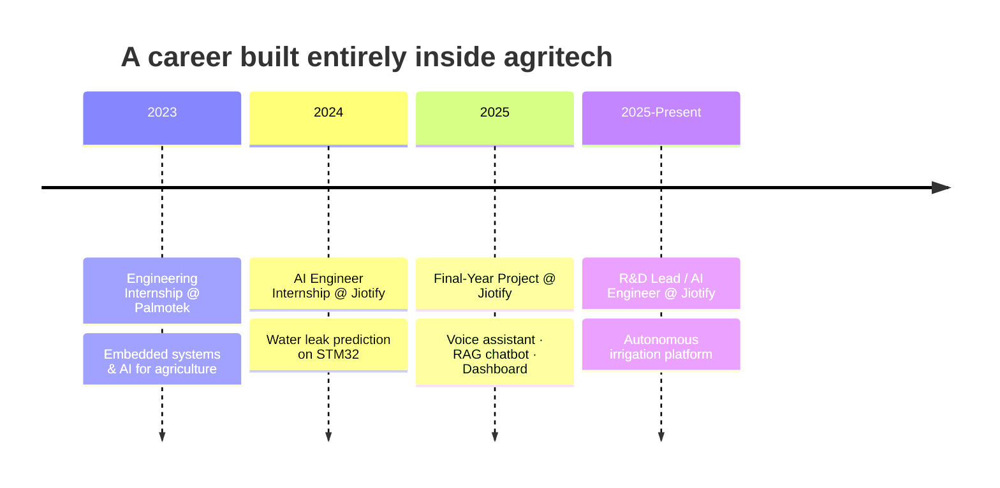

 

 

## 🌱 About Me

> I'm an **Electronics & Communication Systems** engineer (ENET'Com, Sfax) who specialized in **Artificial Intelligence** and applied it to a domain I care deeply about: **smart, sustainable agriculture**.

Over the past two years I've moved from prototyping AI models to **leading R&D initiatives** that deploy them in the field — with real farmers, real hardware, and real constraints.

I'm currently deepening my research interests in **Agentic AI**, **Multi-Agent Systems**, **Edge AI**, and **Federated AI** for agricultural decision support.

 

## 🚜 Agritech Journey — From Internship to R&D Lead

| 📅 Period | 🎯 Role | 🏢 Organization | 🔍 Focus |
|:---:|:---:|:---:|:---|
| 2023 | Engineering Internship | **Palmotek** | Early exposure to embedded systems & AI for agriculture |
| 2024 | AI Engineer Internship | **Jiotify** | Water leak prediction system — ML model deployed on STM32 |
| 2025 | Final-Year Project — AI Engineer | **Jiotify** | Smart connected agriculture platform: voice assistant, RAG chatbot, dashboard |
| **2025 → Now** | **R&D Lead / AI Engineer** | **Jiotify** | Autonomous irrigation platform (ML + IoT + satellite imagery) |

<b>3 internships + 1 year as R&D Lead — all within agritech startups — building a continuous, field-tested understanding of AI applied to agriculture.</b>

 

## 🧠 What I'm Currently Leading

<table>
<tr>
<td width="50%" valign="top">

**🔧 Technical Leadership**
- Designing & deploying AI models for smart irrigation and decision support
- Integrating end-to-end IoT infrastructure (smart valves, pumps, soil-moisture sensors)
- Directing PoC → production pipelines with focus on performance & scalability

</td>
<td width="50%" valign="top">

**📈 R&D Strategy**
- Driving R&D strategy & technology scouting post-ISO certification
- Leading a team from research through to field deployment
- Bridging AI research with real agricultural operations

</td>
</tr>
</table>

 

## 🌾 Field Experience & Farmer-Centered AI

<table>
<tr>
<td width="33%" align="center">

### 🛰️
**On-Site Installations**
Deployed sensors, valves and AI-driven control systems directly at client farms

</td>
<td width="33%" align="center">

### 🗣️
**Direct Farmer Interviews**
Field surveys to understand real needs, constraints & tech adoption patterns

</td>
<td width="33%" align="center">

### 🎯
**Human-Centered Design**
Solutions built around usability & trust — not just technical performance

</td>
</tr>
</table>

 

## 📚 Research & Scientific Engagement

- 📖 Regularly review **scientific literature** on AI applied to agriculture to inform new solutions
- 🎤 Active participant in **events, talks & workshops** on AI in agriculture
- 🛰️ Growing focus on **multimodal data fusion** — IoT streams × satellite/Earth Observation imagery × predictive models

 

## 🛠️ Tech Stack

<table>
<tr>
<td valign="top" width="33%">

**AI & Data**
- Machine Learning
- Deep Learning
- Generative AI (RAG)
- LLM-based agents
- Agentic AI
- Multimodal data fusion

</td>
<td valign="top" width="33%">

**Embedded & IoT**
- Arduino
- Raspberry Pi
- ESP32
- STM32

</td>
<td valign="top" width="33%">

**Languages**
- Python
- C
- C++

</td>
</tr>
</table>

 

## 🔒 A Note on My Projects

> Most of the projects I've built and led were developed under **confidentiality agreements** with the startups I worked for, so you won't find them in public repositories here. I'd be glad to discuss the technical details and results during an interview.

 

## 🎓 Education

<table>
<tr>
<td>🎓</td>
<td><b>Engineering Degree, Electronic & Communication Systems</b> National School of Electronics and Telecommunications of Sfax (ENET'Com) · 2022–2025</td>
</tr>
<tr>
<td>🎓</td>
<td><b>Preparatory Cycle for Engineering Studies</b> IPEIN, Nabeul · 2020–2022</td>
</tr>
</table>

 

## 🎯 Research Interests

 

<i>🌱🤖 Open to research collaborations and PhD opportunities</i>

